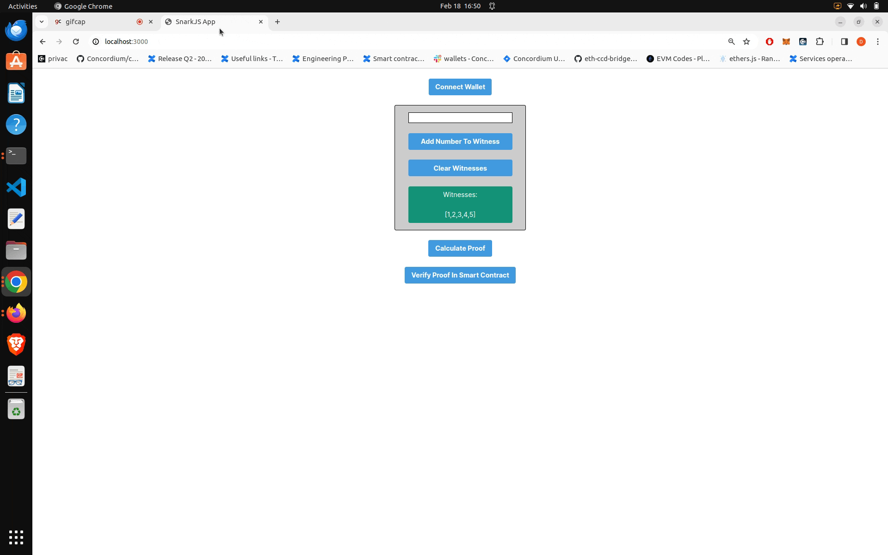

## SnarkJS Front End

This is a demo dApp to showcase how to generate ZK-SNARK proofs (groth16 algorithm) in the browser and verify the proof in the deployed verification smart contract.

Related repo to generate the [circuits](https://github.com/DOBEN/Hardhat-with-Circom).



## Prerequisites

- `node` installed
- `yarn` installed

## Getting Started

- Fill in your `WALLET_CONNECT_PROJECT_ID` for walletConnect and your `ALCHEMY_API_KEY` in the `./constants.ts` file.

- Run the following commands in the root of this project.

```bash
yarn
yarn build
yarn dev
```

- Open URL logged in console (typically http://127.0.0.1:3000).


Note: Use at least node version `18.17.0`.